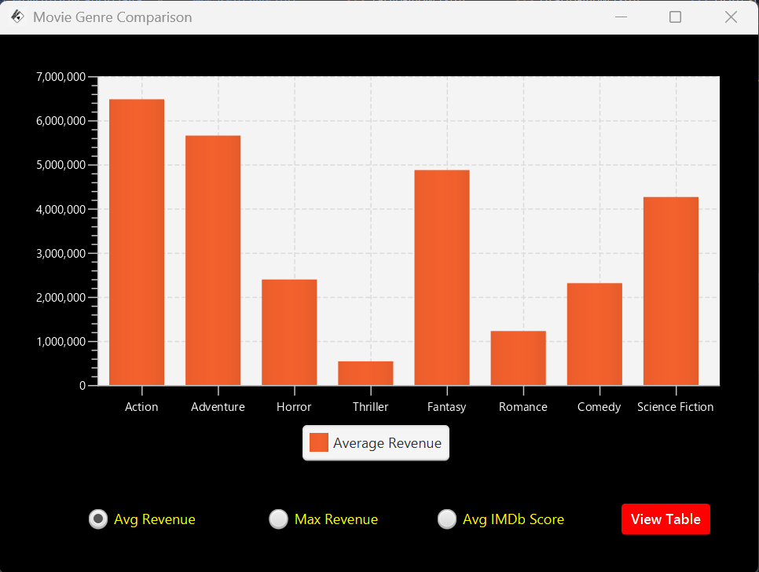
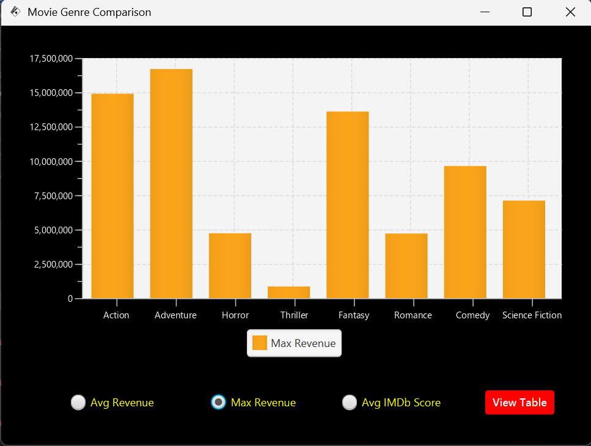
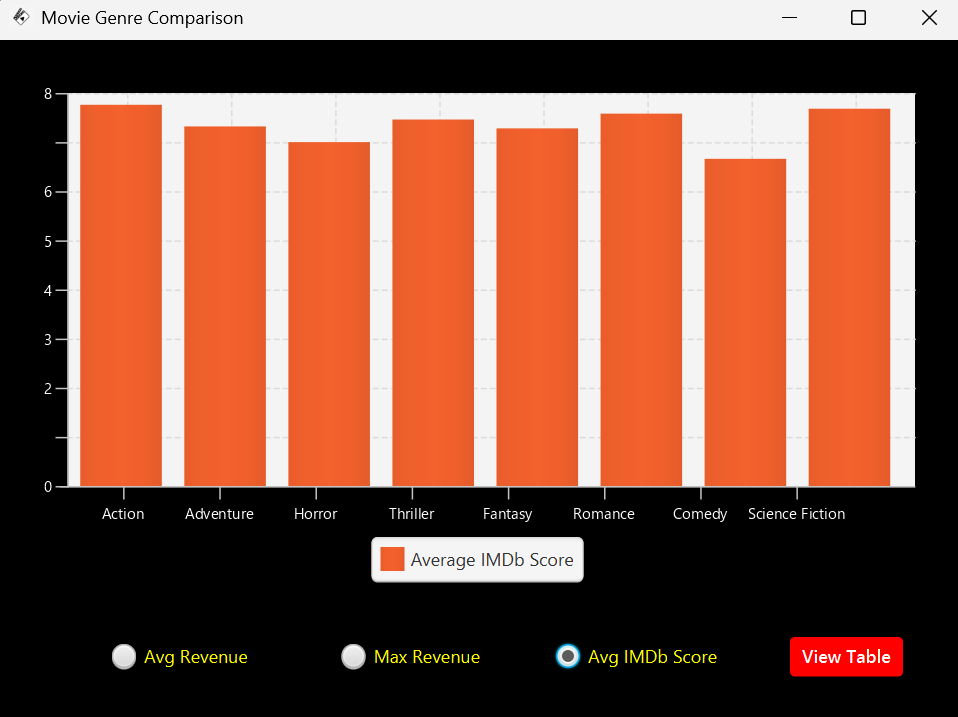
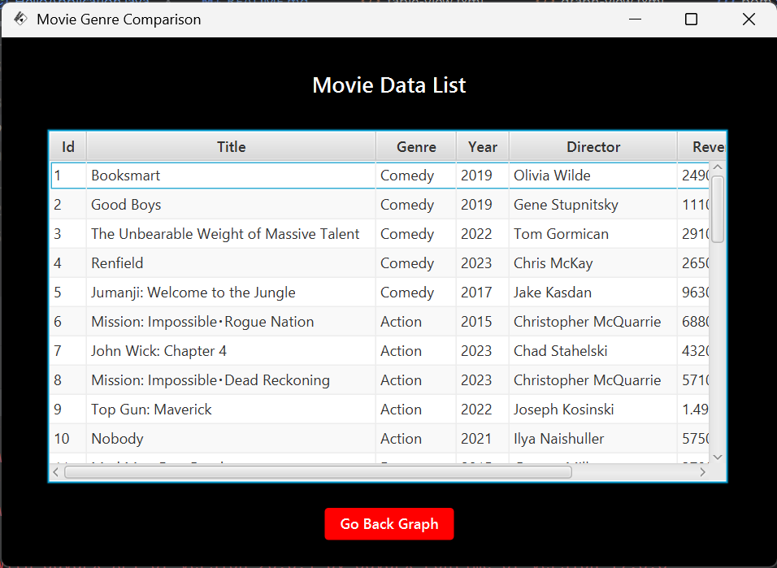

# Assignment-1-GC200605831

This JavaFX application compares movie genres using:
- Average box office revenue
- Highest revenue of movie each genre
- Average IMDb score

Bar charts is switched by radio buttons, and a tableView shows individual movie details.

**Resource from:** [imdb.com](https://www.imdb.com/), [the-numbers.com](https://www.the-numbers.com/), [boxofficemojo.com](https://www.boxofficemojo.com/?ref_=bo_nb_tt_mojologo)

※ I connected to MySQL using credentials from email, but not to AWS RDS.

## 🎬 Genre Bar Chart

## 📋 Movie Table

## 🎥 Demo Video

You can watch the demo video [here](https://go.screenpal.com/watch/cT1DVynXO47)